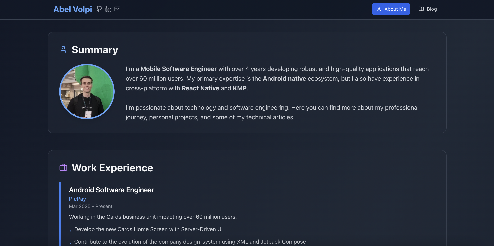

# Personal Portfolio

This is a web application built with React to showcase my professional experience, skills, and blog posts.

You can check it out at: [https://abelvolpi.github.io/personal-portfolio](https://abelvolpi.github.io/personal-portfolio)



## 🎯 Features
- **About Me Section** - Summary about my carreer
- **Blog Section** - Direct links to Medium articles with previews
- **Responsive Design** - Optimized for desktop and mobile devices
- **Smooth Animations** - Elegant transitions and hover effects
- **Social Links** - Quick access to GitHub, LinkedIn, and email

## 📚 Libraries & Tools
- [React](https://react.dev/) - Interface development
- [Tailwind CSS](https://tailwindcss.com/) - CSS framework
- [Lucide React](https://lucide.dev/) - Icon library
- [GitHub Pages](https://pages.github.com/) - Hosting and deployment

## 🚀 Getting Started

### Installation
```bash
# Clone the repository
git clone https://github.com/AbelVolpi/personal-portfolio.git

# Navigate to project directory
cd personal-portfolio

# Install dependencies
npm install

# Start development server
npm start
```

### Deployment
```bash
# Build and deploy to GitHub Pages
npm run deploy
```

